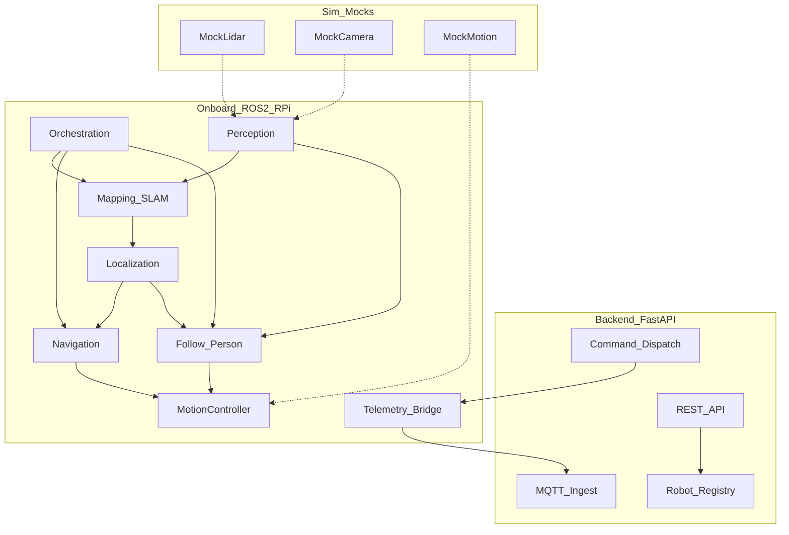
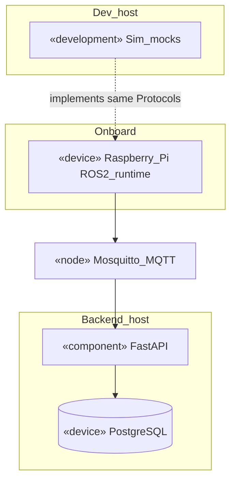
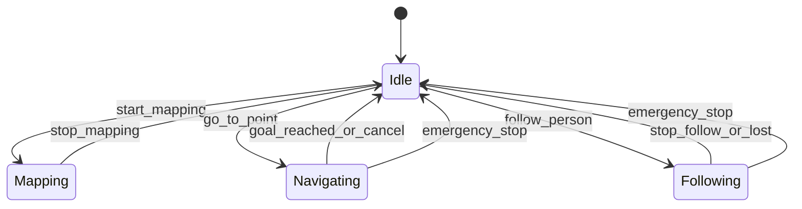
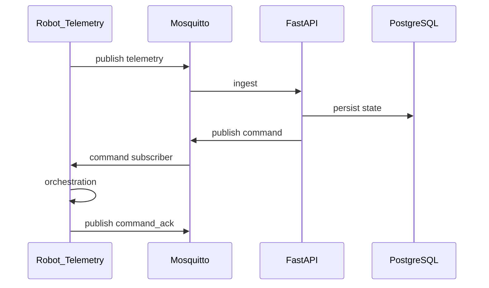
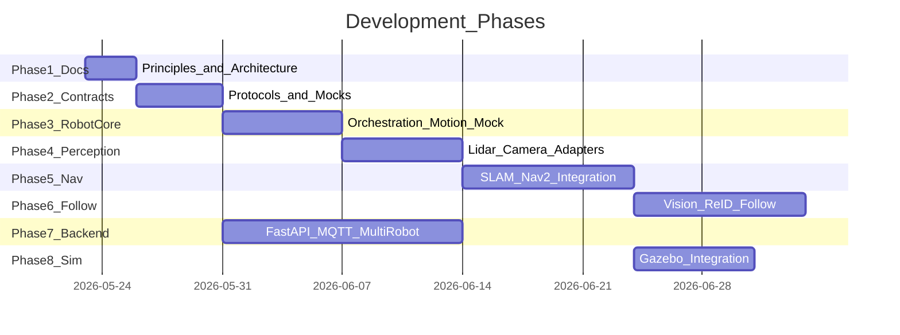

# Архитектура платформы GreenHouse

Документ описывает целевую архитектуру monorepo: onboard (Python + ROS 2 на Raspberry Pi), симуляцию/mocks, backend (FastAPI + PostgreSQL + MQTT) для **управления группой мобильных роботов**.

Подробнее о принципах разработки: [AGENTS.md](../AGENTS.md).

## Принятые решения

| Область | Решение |
|---------|---------|
| Onboard | Python + ROS 2, Raspberry Pi 4/5 |
| Среда | Indoor-помещения, 2D-навигация |
| Датчики | Абстрактные интерфейсы; конкретные модели лидара/камеры подключаются адаптерами |
| Следование | Computer vision + re-identification человека |
| Движение | Абстрактный `MotionController`; реальная платформа позже |
| Карты | Локально на роботе; синхронизация с backend — по контракту, реализация позже |
| Backend | Новый Python FastAPI + PostgreSQL + MQTT, multi-robot |
| Разработка | Mocks параллельно с кодом; Gazebo позже |

## Структура репозитория

```
GreenHouse/
├── AGENTS.md
├── README.md
├── docs/
│   └── ARCHITECTURE.md          # этот файл
├── packages/
│   ├── contracts/
│   ├── robot/
│   ├── backend/
│   └── sim/
└── infra/                       # по мере появления (compose, mosquitto и т.д.)
```

См. также README в каждом пакете и подмодуле.

## Диаграмма системы



## UML-модели модулей

Ниже — **структурный** взгляд (пакеты, контракты, развёртывание). **Поведенческая** топология потоков данных между подсистемами — в разделе **«Диаграмма системы»** выше; машина режимов — в разделе **«Режимы работы робота»** ниже.

### Пакеты и зависимости от контрактов

```mermaid
classDiagram
  namespace fleet_contracts {
    class LidarSource {
      <<interface>>
    }
    class CameraSource {
      <<interface>>
    }
    class MapBuilder {
      <<interface>>
    }
    class Localizer {
      <<interface>>
    }
    class GoalNavigator {
      <<interface>>
    }
    class FollowController {
      <<interface>>
    }
    class MotionController {
      <<interface>>
    }
    class MissionHandler {
      <<interface>>
    }
    class RobotBehavior {
      <<interface>>
    }
    class TelemetryPublisher {
      <<interface>>
    }
    class CommandSubscriber {
      <<interface>>
    }
    class MessagingDTOs {
      <<DTO>>
    }
  }

  namespace robot_onboard {
    class Orchestration
    class PerceptionAdapters
    class MappingSubsystem
    class LocalizationSubsystem
    class NavigationSubsystem
    class FollowSubsystem
    class MotionAdapter
    class TelemetryBridge
  }

  namespace backend {
    class RestAPI
    class MqttInbound
    class MqttCommands
    class RobotsRegistry
  }

  namespace sim {
    class Mocks
  }

  PerceptionAdapters ..|> LidarSource : implements
  PerceptionAdapters ..|> CameraSource : implements
  MappingSubsystem ..> MapBuilder : use
  LocalizationSubsystem ..> Localizer : use
  NavigationSubsystem ..> GoalNavigator : use
  FollowSubsystem ..> FollowController : use
  MotionAdapter ..|> MotionController : implements

  Orchestration ..|> MissionHandler : implements
  Orchestration ..|> RobotBehavior : implements
  Orchestration ..> MapBuilder : use
  Orchestration ..> GoalNavigator : use
  Orchestration ..> FollowController : use
  Orchestration ..> MotionController : use
  Orchestration ..> Localizer : use

  TelemetryBridge ..> TelemetryPublisher : use
  TelemetryBridge ..> CommandSubscriber : use
  TelemetryBridge ..> MessagingDTOs : use
  TelemetryBridge ..> Orchestration : dispatches_to

  MqttInbound ..> MessagingDTOs : validates
  MqttCommands ..> MessagingDTOs : emits

  RestAPI --> RobotsRegistry
  RestAPI --> MqttCommands

  Mocks ..|> LidarSource : implements
  Mocks ..|> CameraSource : implements
  Mocks ..|> MotionController : implements
```

Стереотип **`<<interface>>`** соответствует `Protocol` в Python ([`fleet_contracts`](../packages/contracts/src/fleet_contracts/)). Связь **`..>`** — зависимость (*use*); **`..|>`** — реализация интерфейса (*implements*). Пунктир от **Sim** — подстановка реализаций при разработке и тестах.



**Кратко:** оркестратор реализует `MissionHandler` и `RobotBehavior` и управляет режимами, дергая остальные подсистемы только через интерфейсы из `fleet_contracts`. Входящие команды попадают в оркестратор через связку `TelemetryBridge`/`CommandSubscriber` и доменную модель `fleet_contracts.messaging`. Backend сериализует и валидирует тот же набор DTO (например `TelemetryEnvelope`, дискриминированные полезные нагрузки команд), без привязки к ROS.

### Развёртывание (упрощённо)



На этапе разработки **Sim** подставляет реализации контрактов вместо реальных нод; в проде обмен «робот ↔ облако» идёт через брокер по префиксу `fleet/robots/{robot_id}/…` (описано в разделе **MQTT: дерево топиков** ниже).

## Режимы работы робота

Оркестратор — единая точка переключения режимов; модули общаются через контракты, а не жёсткие связи между пакетами.



## Модули onboard (`packages/robot/`)

Детали: README в каждой папке модуля.

| Модуль | Контракты (`contracts`) | Роль в ROS 2 | Реализация (план) |
|--------|-------------------------|--------------|-------------------|
| `perception/` | `LidarSource`, `CameraSource`, `ImuSource` | Адаптеры сенсоров | Mock → драйверы |
| `mapping/` | `MapBuilder`, `MapStore` | SLAM | `slam_toolbox` adapter |
| `localization/` | `Localizer` | Позиция на карте | Nav2 AMCL adapter |
| `navigation/` | `GoalNavigator`, `PathPlanner` | Достижение целей | Nav2 actions |
| `follow/` | `FollowController`, `PersonDetector`, `PersonReIdentifier` | Vision + следование | OpenCV / ONNX pipeline |
| `motion/` | `MotionController` | Движение | Mock → платформа |
| `orchestration/` | `RobotBehavior`, `MissionHandler` | Конечный автомат режимов | Отдельная нода |
| `telemetry/` | `TelemetryPublisher`, `CommandSubscriber` | Связь с backend | MQTT + при необходимости REST |

## Модули backend (`packages/backend/`)

| Модуль | Назначение |
|--------|------------|
| `robots/` | Регистрация, heartbeat, online/offline |
| `telemetry/` | Приём MQTT телеметрии |
| `commands/` | Публикация команд на роботов |
| `maps/` | Контракт синхронизации карт (реализация позже) |

## Контракты (`packages/contracts/`)

- **Protocol**: интерфейсы сенсоров, навигации, движения, телеметрии — см. код пакета.
- **Pydantic-модели**: payload команд, телеметрии, состояние робота.
- **MQTT**: префикс и дерево топиков — см. `fleet_contracts.messaging`; схемы JSON совпадают с DTO.
- **Robot id**: строка без пробелов (`^[a-zA-Z0-9_-]+$`); задаётся при регистрации.

Robot и backend импортируют типы только из `contracts`; ROS остаётся в адаптерах `packages/robot`.

## ROS 2: планируемый граф (этап интеграции)

Эти топики именованы условно; финальное дерево задаётся в launch-файлах и README модулей.

| Тип | Имя (пример) | Назначение |
|-----|--------------|------------|
| Подписка | `/scan` | Лидар (sensor_msgs/LaserScan в адаптере) |
| Подписка | `/camera/image_raw` | Камера (в адаптере преобразуется в доменную модель) |
| Pub/Sub | `/map`, `/tf` | Карта и преобразования (через стандартные пакеты) |
| Публикация | `/cmd_vel` | Команды скорости (через `MotionController` adapter) |
| Публикация / параметр | `robot_mode` (топик или latched msg — уточнить при оркестрации) | Текущий режим |

## MQTT: дерево топиков (контракт)

Базовый префикс: `fleet/robots/{robot_id}`.

| Топик | Направление | Описание |
|-------|-------------|----------|
| `.../telemetry` | Robot → Backend | Pose, режим, батарея, ошибки (JSON по схеме `TelemetryEnvelope`) |
| `.../commands` | Backend → Robot | Команды `go_to`, `follow_person`, `stop`, `start_mapping` и т.д. |
| `.../commands/ack` | Robot → Backend | Подтверждение/отказ (JSON по схеме `CommandAck`) |

Подробности полей: исходники в [`../packages/contracts/src/fleet_contracts/`](../packages/contracts/src/fleet_contracts/) (начните с `messaging.py`).

## REST API (контракт без реализации)

Планируются эндпоинты для операторского управления флотом (точный OpenAPI добавится с `packages/backend`):

| Метод | Путь | Назначение |
|-------|------|------------|
| `GET` | `/robots` | Список зарегистрированных роботов и статус |
| `GET` | `/robots/{robot_id}` | Детали одного робота |
| `POST` | `/robots/{robot_id}/commands` | Отправить команду (дулируется в MQTT) |
| `GET` | `/robots/{robot_id}/telemetry/latest` | Последнее сохранённое состояние (из БД) |

## Взаимодействие robot ↔ backend



## Mocks и симуляция (`packages/sim/`)

Исполняемый пакет **`fleet-sim`** (см. [`packages/sim/README.md`](../packages/sim/README.md)): топология из трёх связанных комнат, лидара через рейкаст стен, правдивой локализации (`SimTruthLocalizer`), движка точки в плоскости, геометрического «детектора» цели (`SimPersonDetector`) и демо `fleet-sim-demo` с фазами exploration / follow без ROS. Для наглядности: **`fleet-sim-viz`** — окно matplotlib со стенами, лучами лидара, роботом и целью.

Имена реализаций (можно подставлять вместо железа и ROS):

| Реализация | Интерфейс | Назначение |
|------------|-----------|------------|
| `SimLidarSource` | `LidarSource` | Скан по аналитическим стенам комнат |
| `SimCameraSource` | `CameraSource` | Синтетический кадр-заглушка под детектор |
| `SimMotionController` | `MotionController` | Интеграция команд скорости в сим-состояние |
| `SimTruthLocalizer` | `Localizer` | Поза робота как у симулятора (без SLAM) |
| `SimPersonDetector` | `PersonDetector` | Видимость цели в упрощённом FOV |

Далее: Gazebo и мост к тем же контрактам; unit-тесты рейкаста.

## Заметки по indoor и RPi

- **SLAM:** ориентация на 2D лидар и `slam_toolbox` или аналог в ROS 2.
- **Nav2:** планирование и контроль для indoor.
- **Follow:** детекция + re-ID; не смешивать с классической `NavigateToPose` без явного режима оркестратора.
- **Вычисления:** на RPi re-ID возможен только с лёгкими моделями; интерфейс `PersonDetector` позволит заменить backend детекции (например, на Jetson) без смены оркестратора.

## Roadmap разработки



## Ссылки на модули

- [contracts](../packages/contracts/README.md)
- [robot](../packages/robot/README.md)
- [backend](../packages/backend/README.md)
- [sim](../packages/sim/README.md)
