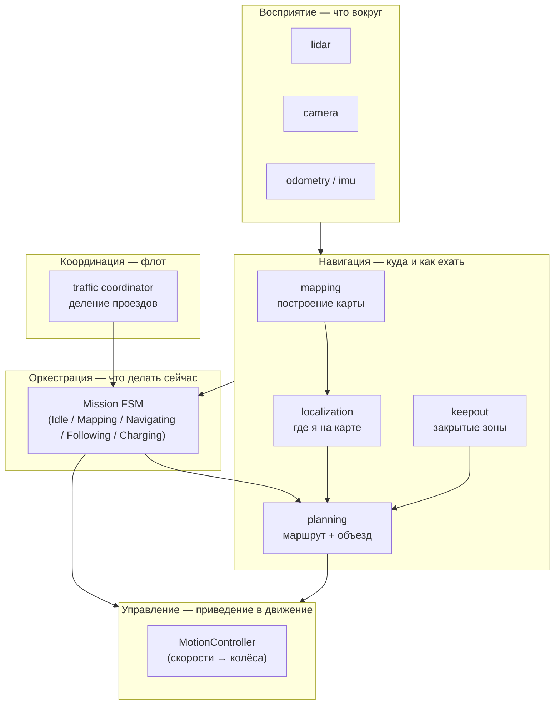
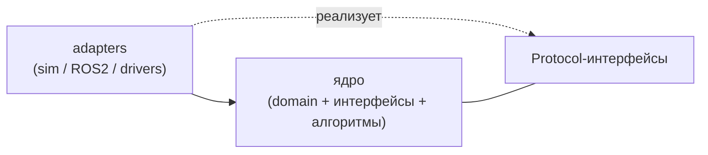
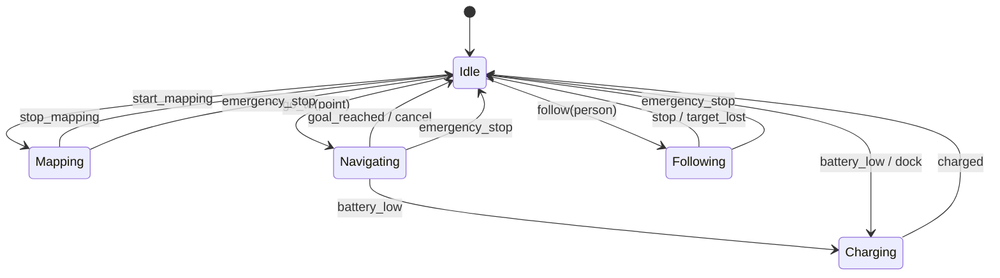
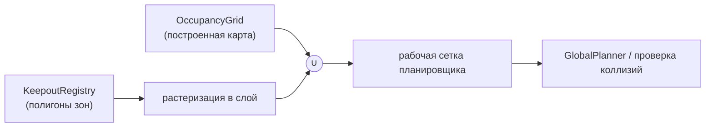
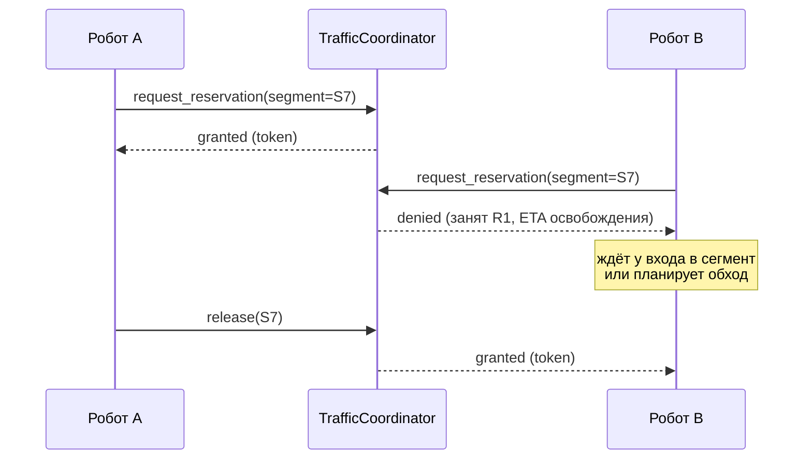
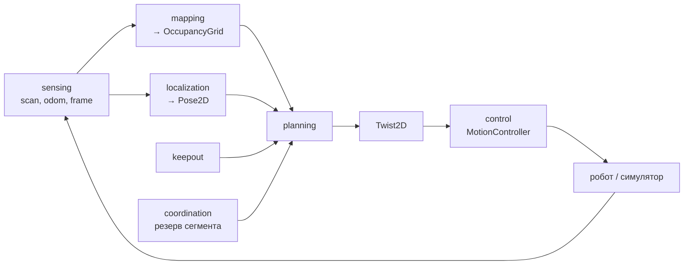
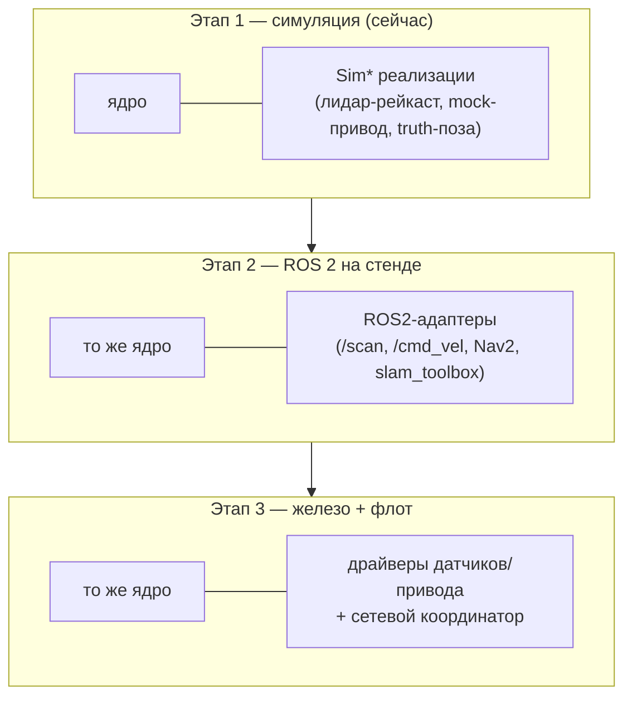

# Архитектура GreenHouse

Платформа для флота автономных мобильных роботов, перевозящих грузы в теплице.
Документ описывает **целевую архитектуру с нуля**: слои, интерфейсы, режимы работы,
keep-out зоны и координацию нескольких роботов.

> Стек: **Python**. Ядро **не зависит от транспорта** — домен, интерфейсы и алгоритмы
> ничего не знают про ROS. ROS 2 / Nav2, реальные драйверы и сетевой обмен подключаются
> позже как **адаптеры** за теми же интерфейсами, что и симуляция.

---

## 1. Цели и возможности

Робот в теплице должен уметь:

| Возможность | Где живёт |
|---|---|
| Ехать за человеком, которому помогает | `orchestration` (режим Following) + `navigation`, `sensing` |
| Ехать на точку выгрузки | `orchestration` (режим Navigating) + `navigation` |
| Ехать на зарядку | `orchestration` (режим Charging) + `navigation` |
| Строить карту окружения | `navigation.mapping` |
| Понимать, где он находится | `navigation.localization` |
| Строить маршрут до цели | `navigation.planning` |
| Объезжать препятствия | `navigation.planning` (локальный слой) + `sensing` |
| Помечать область как закрытую (keep-out) | `navigation.keepout` |
| Делить узкие проезды между роботами | `coordination` |

---

## 2. Принципы

**Contract-first.** Граница каждого модуля — это интерфейс (`typing.Protocol`) и набор
доменных типов (Pydantic). Реализации сменяемы: симуляция, mock, реальное железо —
каждая удовлетворяет одному и тому же контракту.

**Ядро независимо от транспорта.** В `domain`, `navigation`, `orchestration`,
`coordination` нет импортов `rclpy`, сети, файловой системы. Это делает их полностью
тестируемыми в симуляции и переносимыми. Транспорт (ROS 2, MQTT) живёт только в адаптерах.

**Заменяемые реализации за одним интерфейсом.** Один и тот же `LidarSource` имеет
реализацию `SimLidar` (сейчас) и `Ros2Lidar` (позже). Оркестратор не меняется при смене реализации.

**Сначала симуляция.** У каждого значимого интерфейса появляется sim-реализация
до или параллельно железу. Разработка не блокируется отсутствием датчиков.

**Инкремент за инкрементом, вертикальными срезами.** Один шаг = один модуль или один
понятный слой + его проверка. Не «вся навигация и весь backend в одном куске».

**Типобезопасность на границах.** На стыках модулей — `Protocol` + валидируемые
Pydantic-модели, а не «сырые словари». Никаких небезопасных `cast`/`Any`.

---

## 3. Слои

Три прикладных слоя из задания плюс три опорных.



- **Восприятие (`sensing`)** — поставляет «сырые» наблюдения: скан лидара, кадр камеры,
  одометрию, IMU. Только чтение датчиков, без интерпретации.
- **Навигация (`navigation`)** — превращает наблюдения в карту, позу, маршрут и команды
  объезда. Содержит keep-out зоны.
- **Управление (`control`)** — единственный слой, который физически двигает робота:
  принимает желаемую скорость (`Twist2D`) и доводит её до привода (или до симулятора).
- **Координация (`coordination`)** — межроботный слой: кто и когда занимает проезд.
- **Оркестрация (`orchestration`)** — конечный автомат режимов; дёргает остальные слои
  только через их интерфейсы.
- **Runtime (`runtime`)** — опорные абстракции (часы/таймер), чтобы алгоритмы не звали
  `time.time()` напрямую и были детерминированно тестируемы.

### Правило зависимостей

Зависимости направлены **внутрь**, к домену. `domain` не зависит ни от кого.
Слои зависят от `domain` и от интерфейсов соседей — **не** от их реализаций.
ROS 2 и сеть зависят от ядра, но ядро о них не знает.



---

## 4. Каталог модулей и интерфейсов

| Модуль | Ключевые типы и интерфейсы | Назначение |
|---|---|---|
| `domain/geometry` | `Point2D`, `Pose2D`, `Twist2D` | Планарные примитивы |
| `domain/grid` | `CellState`, `MapMeta`, `OccupancyGrid` | Сеточная карта занятости |
| `domain/identifiers` | `RobotId`, `ZoneId`, `MissionId`, `SegmentId` | Стабильные идентификаторы |
| `domain/errors` | `LocalizationLost`, `PlanningFailed`, … | Доменные ошибки |
| `sensing` | `LidarScan` · `LidarSource`; `CameraFrame` · `CameraSource`; `Odometry` · `OdometrySource`; `ImuSample` · `ImuSource` | Чтение датчиков |
| `control` | `MotionLimits` · `MotionController` | Приведение в движение |
| `navigation/mapping` | `MapBuilder`, `MapStore` | SLAM-сессия, хранение карт |
| `navigation/localization` | `PoseEstimate` · `Localizer` | Оценка позы на карте |
| `navigation/planning` | `Path` · `GlobalPlanner`, `LocalPlanner`, `GoalNavigator` | Маршрут + объезд препятствий |
| `navigation/keepout` | `Zone`, `ZoneKind` · `KeepoutRegistry` | Закрытые/медленные зоны |
| `coordination` | `Reservation` · `TrafficCoordinator` | Деление проездов флотом |
| `orchestration` | `RobotMode` · `MissionHandler`, `Behavior`, `RobotContext` | FSM режимов |
| `runtime` | `Clock` | Абстракция времени |

Полные сигнатуры — в коде `src/greenhouse/`. Ниже — поведенческие модели.

---

## 5. Режимы работы робота

Оркестратор — единственная точка переключения режимов. Переходы инициируются командами
оператора/человека или событиями (цель достигнута, цель потеряна, низкий заряд).



**Безопасность.** Потеря локализации или потеря цели в `Following` — это переход в
безопасное состояние (остановка), а не «ехать вслепую». Эти переходы описаны в контрактах
оркестрации и команд.

---

## 6. Закрытые зоны (keep-out)

Зона — это именованная область с типом поведения:

| `ZoneKind` | Эффект на планирование |
|---|---|
| `KEEPOUT` | Полностью непроезжая: ячейки внутри считаются занятыми |
| `SLOW` | Проезжая, но с ограничением скорости (приоритет полки/людей) |
| `PREFERRED` | Поощряемая (например, основной проезд) — снижает стоимость пути |

Зоны задаются как полигоны в системе координат карты и **растеризуются** в дополнительный
слой поверх карты занятости. И глобальный планировщик, и проверка коллизий используют
**одну и ту же** итоговую сетку занятости (карта ∪ keep-out), чтобы план и реальное
движение согласовывались.



Зоны редактируются во время работы (оператор отметил область) — планировщик перечитывает
слой при следующем перепланировании.

---

## 7. Координация нескольких роботов

Проезды в теплице узкие — два робота не разъедутся. Координация строится на
**резервировании сегментов**, а не на «каждый сам по себе».

Карта проездов делится на **сегменты** (участки между перекрёстками/расширениями).
Прежде чем въехать в сегмент, робот запрашивает резерв у `TrafficCoordinator`.



Свойства слоя:

- **Взаимное исключение** на занятых сегментах — нет лобовых встреч в узких проездах.
- **Предотвращение тупиков (deadlock)** — резервы запрашиваются в согласованном порядке;
  при невозможности получить путь целиком робот ждёт у входа, а не застревает в середине.
- **Точки разъезда** — широкие участки (`PASSING_PLACE`) не требуют эксклюзива.
- Координатор сначала живёт как in-process сервис в симуляции (несколько роботов в одном
  процессе), затем выносится за сетевой адаптер (MQTT/брокер) без смены интерфейса.

---

## 8. Поток данных (один цикл управления)



Оркестратор выбирает **цель** этого цикла в зависимости от режима (точка выгрузки,
поза человека, док зарядки), планировщик строит путь и локальные команды, управление их исполняет.

---

## 9. Эволюция развёртывания

Один и тот же набор интерфейсов проходит через три стадии — меняются только адаптеры.



Ключ переноса: **планирование и проверка коллизий используют единую модель занятости**
(габарит робота + карта + зоны). В симуляции это диск против сегментных стен; в Nav2 —
polygon footprint + costmap-слои. Геометрия одна — поведение переносится предсказуемо.

---

## 10. Структура репозитория

```
GreenHouse/
├── README.md
├── pyproject.toml
├── docs/
│   ├── ARCHITECTURE.md      # этот файл
│   └── ROADMAP.md           # план инкрементов
└── src/greenhouse/
    ├── domain/              # geometry, grid, identifiers, errors
    ├── sensing/             # интерфейсы датчиков
    ├── control/             # MotionController
    ├── navigation/          # mapping, localization, planning, keepout
    ├── coordination/        # TrafficCoordinator
    ├── orchestration/       # режимы и MissionHandler
    └── runtime/             # Clock
```

Адаптеры (`adapters/sim`, `adapters/ros2`) добавляются отдельными инкрементами и здесь
ещё не созданы намеренно — сначала фиксируем ядро и интерфейсы.

См. также [ROADMAP.md](ROADMAP.md).
