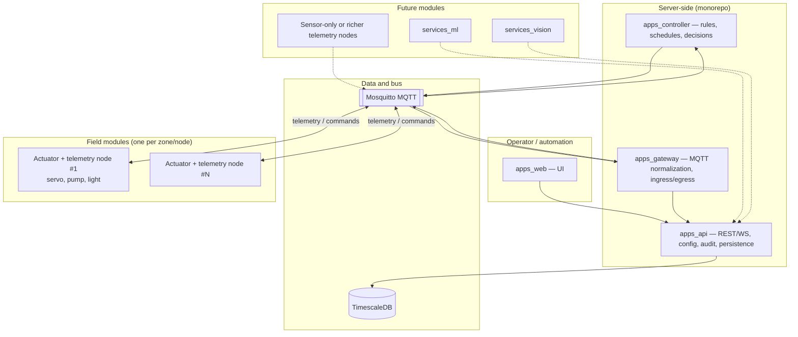
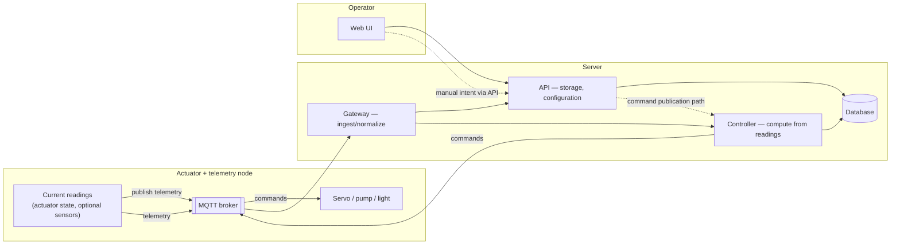
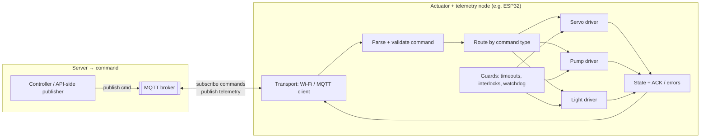
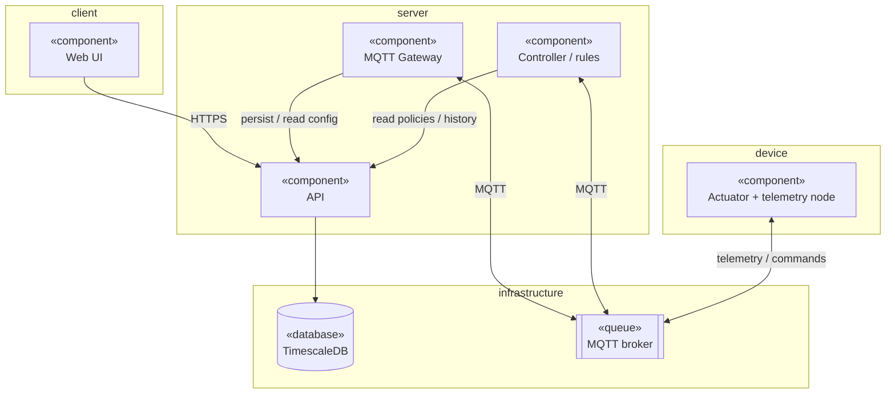
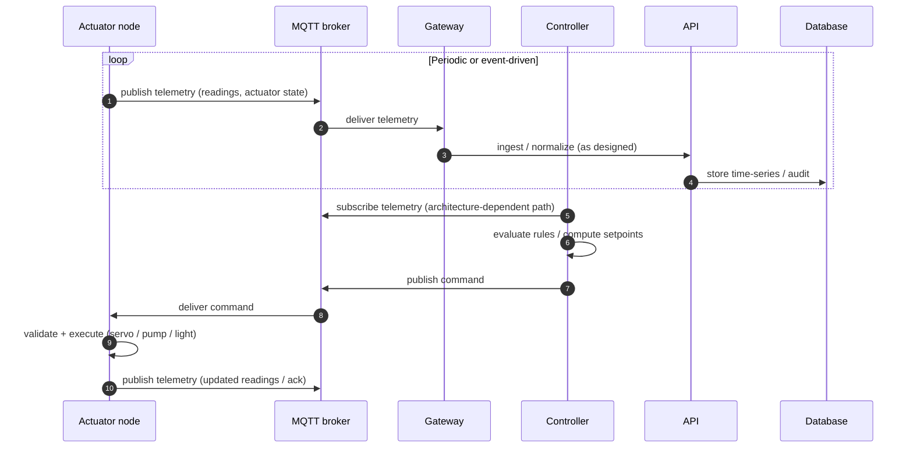
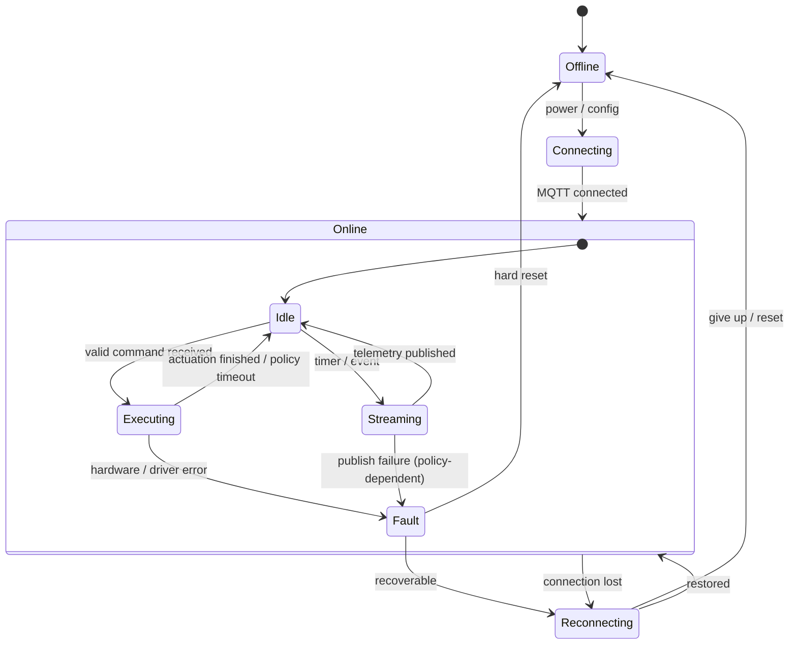

# Architecture source of truth (diagrams)

This document is the **canonical reference** for how the greenhouse system is structured, how the **edge actuator + telemetry node** behaves, and how **telemetry flows up** and **commands flow down**.

Other documents should **link here** instead of duplicating diagrams. When implementation diverges (topics, payloads, services), either **update this file first** or record an ADR explaining the intentional deviation.

## Scope

- **Whole system**: modular layout (cloud services, broker, database, UI, field nodes).
- **Control loop**: node publishes readings and actuator state; server-side logic computes decisions; commands return to the node.
- **Edge node (first module)**: transport, validation, actuation (servo, pump, light), safety hooks, telemetry/ack.
- **UML views**: component dependencies, sequence for the control loop, state machine for the node runtime.

Concrete **MQTT topic trees** and **JSON schemas** belong in `packages/shared-types` (and mirrored in firmware) once defined; this file defines **structure and responsibilities** they must satisfy.

---

## 1. Modular system architecture

---

## 2. Closed loop: telemetry up, commands down

**Intended data flow**

1. The node publishes **telemetry** (measurements, derived actuator state, health).
2. **Gateway** normalizes and may forward to **API** for persistence.
3. **Controller** consumes telemetry (directly or via gateway path), applies rules/schedules, and **publishes commands** to MQTT.
4. The node **subscribes to commands**, executes, and reflects results in subsequent telemetry.

---

## 3. Edge node: internal structure (first module)

**Telemetry composition (conceptual)**

- **Actuator truth**: actual lamp/pump state (and servo position or target), not only last requested command.
- **Optional sensing**: any sensors co-located on the node feed the same telemetry stream when present.
- **Operational**: last accepted command id, errors, firmware/build id as needed for operations.

---

## 4. UML component diagram

Stereotypes use Guillemets-style labels in node text for readability in Mermaid.

---

## 5. UML sequence diagram (readings → compute → command)

---

## 6. UML state machine (node runtime)

---

## Change policy

- **Diagram-first**: update this document when changing boundaries (new service, new node type, new bus).
- **Contracts**: topic names and payload shapes are **not** authoritative here; define them in shared schemas and keep this file aligned at the **box-and-arrow** level.
