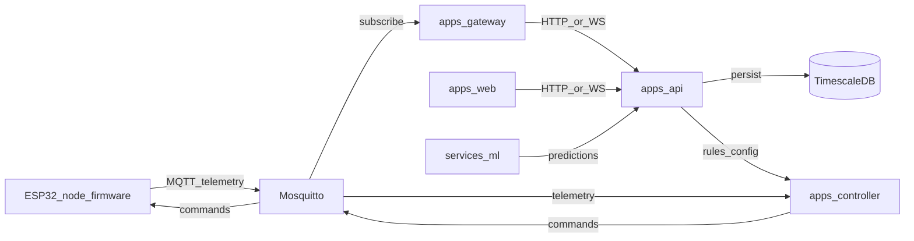

# Architecture overview

Greenhouse is a **multi-language monorepo**: TypeScript services and libraries under `pnpm` workspaces, Python under `services/`, firmware under `firmware/`.

**Canonical diagrams** (modular system, control loop, edge node, UML component/sequence/state): see [architecture-source-of-truth.md](./architecture-source-of-truth.md). Prefer updating that file as the single diagram source; this page stays a short orientation and component index.

## High-level data flow

## Components

| Area | Path | Role |
|------|------|------|
| API | `apps/api` | REST/WebSocket, persistence, auth, configuration. |
| Web | `apps/web` | Operator UI. |
| Gateway | `apps/gateway` | MQTT ingress/egress, normalization. |
| Controller | `apps/controller` | Rule engine for irrigation, lighting, ventilation. |
| Shared types | `packages/shared-types` | Cross-service contracts (schemas to be added). |
| Control domain | `packages/control-domain` | Domain model for control logic. |
| ML | `services/ml` | Python models and inference (future). |
| Vision | `services/vision` | Python CV pipelines (future). |
| Firmware | `firmware/esp32-node` | Edge device firmware (PlatformIO). |
| Infra | `infra/` | Local Postgres/TimescaleDB, Mosquitto, Adminer. |

## Next implementation focus

The first feature slice will be the **control module** (irrigation, lighting, ventilation), implemented incrementally in `apps/controller` with types in `packages/control-domain` and contracts in `packages/shared-types`.
